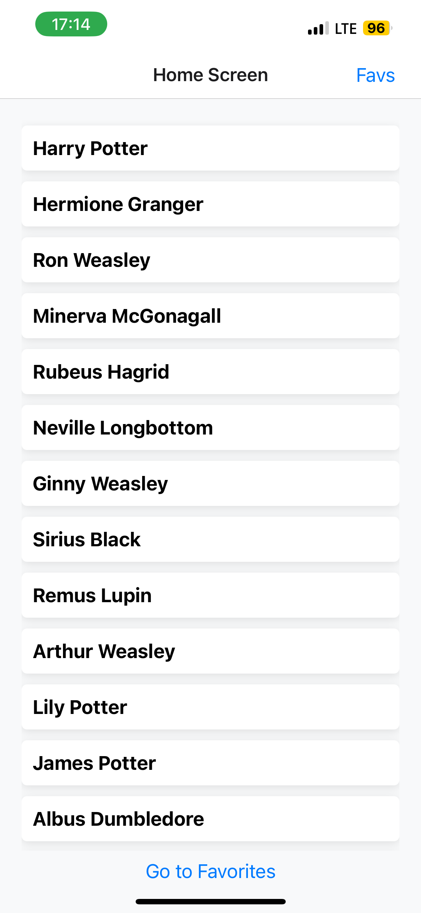
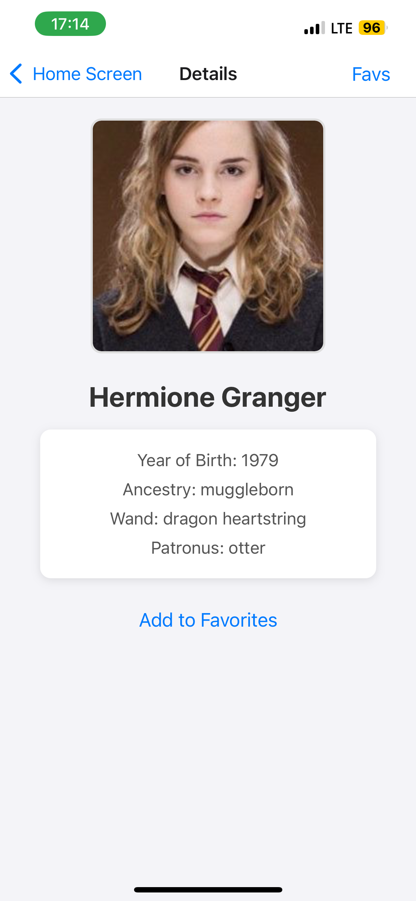
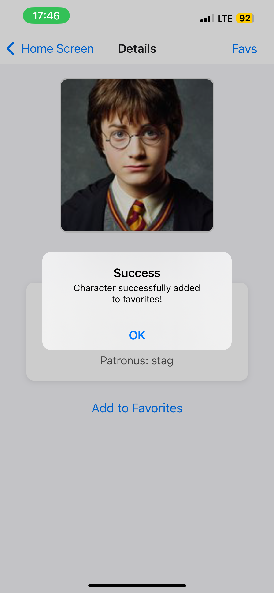
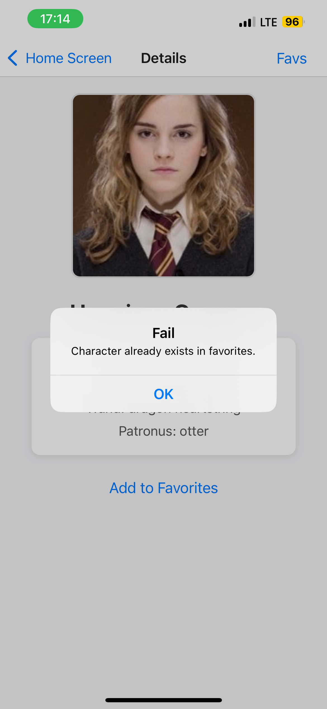
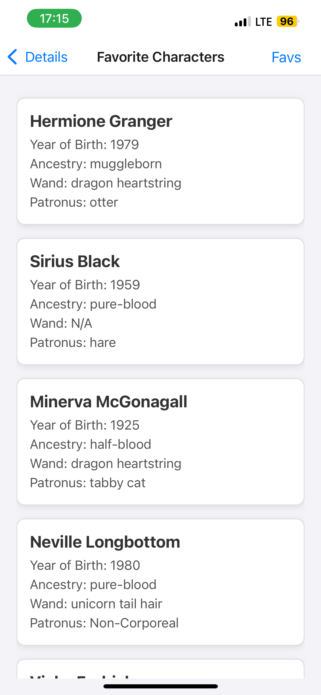

# Gryffindor explorer - mobile

Gryffindor Explorer is a mobile app that displays Harry Potter characters from Gryffindor using the [Harry Potter API](https://hp-api.onrender.com/api/characters/house/gryffindor).

This project is built with:
- Expo (React Native framework)
- Redux (State management)
- Firebase (Backend services)

<br>

## 📱 Screens & Features
### 🏠 Home Screen <br>
- Displays a list of Gryffindor characters.
- Clicking on a character navigates to the Details Screen.



### 📜 Details Screen  <br>
- Shows detailed information about the selected character.
- If any information is missing, it displays N/A.



### ⭐ Add to Favorites <br>
- Allows users to add characters to their Favorite Characters screen.
- If a character is already added, it shows a failure alert; otherwise, it shows a success alert.




### ❤️  Favorite Characters Screen <br>
- Displays a list of characters added to favorites.




<br>

## 📂 Project Structure
```
.
├── App.js
├── README.md
├── app.json
├── babel.config.js
├── config
│   └── firebaseConfig.js
├── nav
│   └── AppNavigator.js
├── package-lock.json
├── package.json
├── redux
│   ├── actionTypes.js
│   ├── actions.js
│   ├── reducers
│   └── store.js
└── screens
    ├── DetailsScreen.js
    ├── FavCharatersScreen.js
    └── HomeScreen.js
```

<br>

## 🚀 How to Run the Project
### 1️⃣ Set Up Firebase Configuration

Create a `.my_settings.js` file in the root directory and add your Firebase configuration:
```
// Used in firebaseConfig.js
const firebaseConfig = {
  apiKey: API_KEY,
  authDomain: AUTH_DOMAIN,
  projectId: PROJECT_ID,
  storageBucket: STORAGE_BUCKET,
  messagingSenderId: MESSAGING_SENDER_ID,
  appId: APP_ID
};
```
### 2️⃣ Start the App

Run the following command in the root directory:

For macOS:
```
sudo npx expo start --tunnel
```
For Windows:
```
npx expo start --tunnel
```

### 3️⃣ Scan the QR Code

Once the terminal displays a QR code, scan it using the Expo Go app on your mobile device to launch the application.